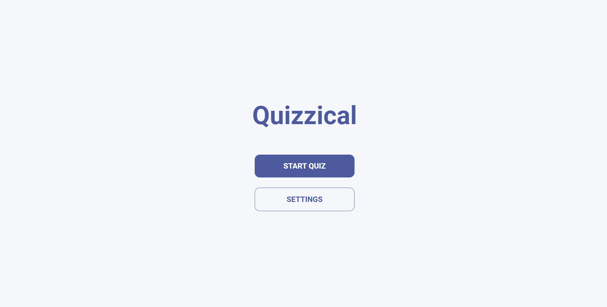
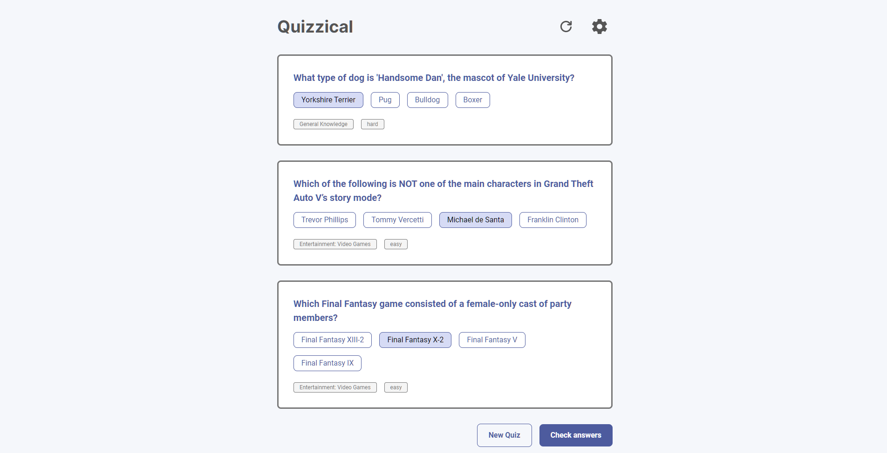
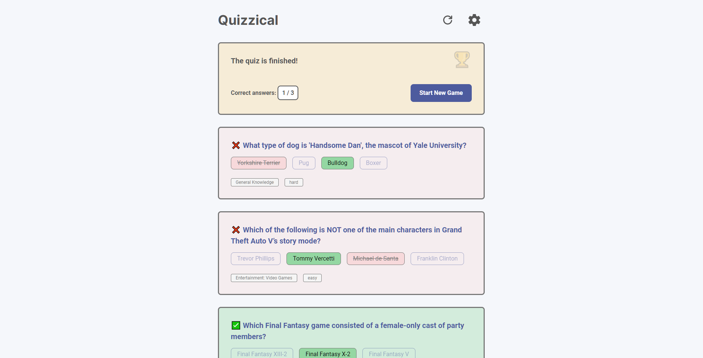
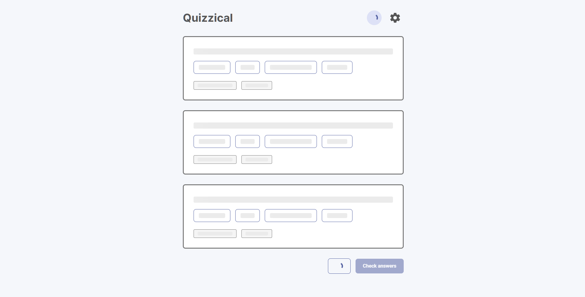
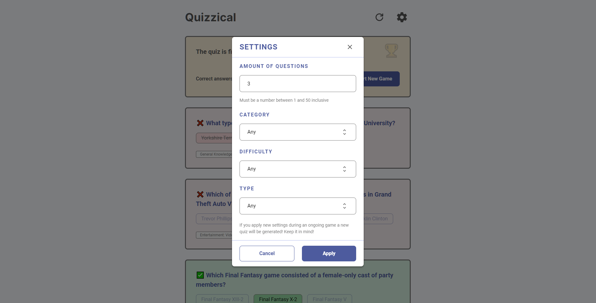
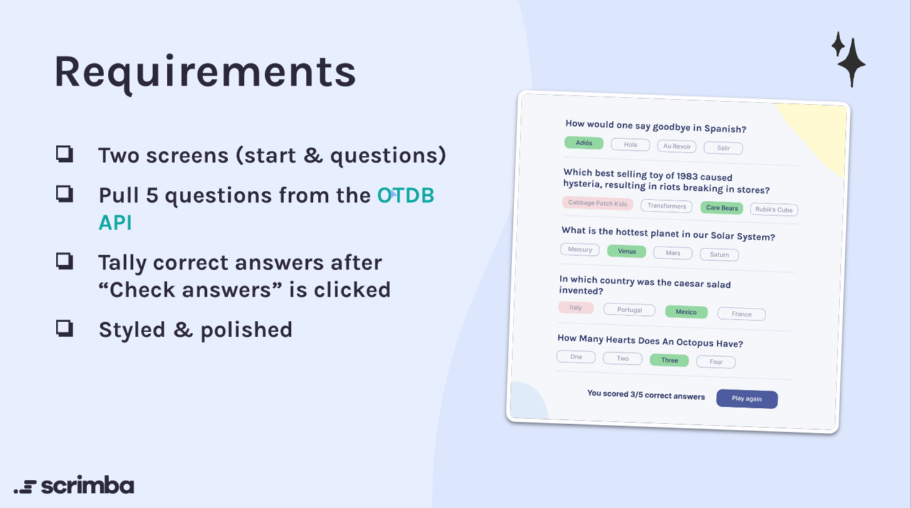

<h1 align="center">Quizzical</h1>
<p align="center">
  Made with <code>HTML</code>, <code>CSS</code>, <code>TypeScript</code>, <code>ReactJS</code>, <code>styled-components</code>, <code>react-router</code>, <code>redux-toolkit</code>
  <br>
  Bootstrapped with <code>Create React App</code>
</p>

<p align="center">
  <a href="../../commits"></a>
  <a href="./LICENSE"></a>
  
</p>

<p align="center">
  <a href="#-screenshots">🖼 Screenshots</a> • 
  <a href="#ℹ%EF%B8%8F-about">ℹ️ About</a> • 
  <a href="#%EF%B8%8F-tools">⚙️ Tools</a> • 
  <a href="#-build-project">🔨 How to Build Project</a> • 
  <a href="#-file-structure">📁 File Structure</a>
</p>

<sup>
  <p align="center">
    <a href="#-npm-packages-worth-mentioning">📦 NPM Packages worth mentioning</a> • 
    <a href="#-details">💡 Details</a> • 
    <a href="#-useful-resources">🔗 Useful resources</a> • 
    <a href="#-author">👤 Author</a>
  </p>
</sup>

## 🖼 Screenshots

<p align="center">
  
</p>

<p align="center">
  
</p>

<p align="center">
  
</p>

<p align="center">
  
</p>

<p align="center">
  
</p>

## ℹ️ About

This is a solo challenge "Quizzical" from Scrimba React Course ([link](https://scrimba.com/learn/learnreact/react-section-4-solo-project-co24f49bea8aace7c174082c8)).

The challenge is to create from scratch a Quizzical application.

API: https://opentdb.com/api_config.php

<p align="center">
  
</p>

I made my own Figma prototype and redesigned the whole application.

Figma prototype: https://www.figma.com/file/0SIScG6N67cgfIvsY5cQng/Quizzical-App

## ⚙️ Tools

- **HTML5**
  - ReactJS
- **CSS**
  - styled-components
- **TypeScript**
  - ReactJS
  - Redux
  - Redux Toolkit
- **NodeJS**
- **Create React App**
- **Github Pages**

## 🔨 Build project

<table>
  <tr>
    <th>Command</th>
    <th>Description</th>
  </tr>
  <tr>
    <td><code>npm&nbsp;install</code></td>
    <td>Installs required npm packages. Run it before building the project</td>
  </tr>
  <tr>
    <td><code>npm&nbsp;start</code></td>
    <td>Starts a local web server with HMR (Hot Module Replacement) for development</td>
  </tr>
  <tr>
    <td><code>npm&nbsp;run&nbsp;predeploy</code></td>
    <td>Builds the project, and outputs to the folder <code>./build</code></td>
  </tr>
</table>

## 📁 File Structure

```Markdown
├── 📁 src                            Source files needed for application development
│   ├── 📁 app                        Hooks for work with Redux store (Redux toolkit)
│   ├── 📁 features                   Redux slices (Redux toolkit)
│   ├── 📁 assets                     Static assets, referred to in src
│   ├── 📁 styles                     Global styles
│   ├── 📁 components                 React components
|   |   └── 📁 Component Name
|   |       ├── 📝 index.tsx          Component logic
|   |       ├── 📝 index.styled.tsx   Component styles
|   |       └── 📝 index.types.tsx    Component types (optional)
│   ├── 📁 pages                      React page components
|   |   └── 📁 Page Name
|   |       ├── 📝 index.tsx          Page logic
|   |       ├── 📝 index.styled.tsx   Page styles
|   |       └── 📝 index.types.tsx    Page types (optional)
│   ├── 📝 App.tsx                    App React component
│   ├── 📝 index.tsx                  Entry point for the module bundler
│   └── 📝 react-app-env.d.ts         Some Typescript stuff for Create React App
|
├── 📁 docs                   Additional information, documentation 
│   └── 📁 results            Screenshots of how the application works after being fully developed
|
├── 📁 public                 Static assets: images, icons, favicons, index.html
|
├── 📝 LICENSE                MIT License. Basically you can do whatever you want with the code
├── 📝 tsconfig.json          TypeScript configuration file
├── 📝 package-lock.json      Keeps track of the exact version of every package that is installed
├── 📝 package.json           Various metadata relevant to the project, scripts, dependencies
├── 📝 .gitignore             Instructions for Git about what files to ignore
└── 📝 README.md              Project description
```

## 📦 NPM Packages worth mentioning

<table>
  <tr>
    <td><code>react-detect-offline</code></td>
    <td>Used it to display a component that is shown only when the user is offline</td>
  </tr>
  <tr>
    <td><code>react-loading-skeleton</code></td>
    <td>Used it to show skeletons while fetching new data</td>
  </tr>
  <tr>
    <td><code>react-toastify</code></td>
    <td>Used it to display notifications that disappear over time</td>
  </tr>
  <tr>
    <td><code>react-outside-click-handler</code></td>
    <td>Used it to close options list in select component when clicking outside</td>
  </tr>
  <tr>
    <td><code>@reduxjs/toolkit</code>, <code>react-redux</code></td>
    <td>Used them to store state in one place</td>
  </tr>
  <tr>
    <td><code>react-router-dom</code></td>
    <td>Used it to route user between pages</td>
  </tr>
</table>

## 💡 Details

My first ReactJS project with Create React App.

- First time using Redux, Redux toolkit
- Made custom select components
- Made a custom modal window (React Portal). Changing settings will change query params for API
- Made API requests using RTK Query
- Custom skeleton components. They rely on a `react-loading-skeleton` library
- Made routing with React Router

This was quite a big project. The description is quite short, but well... I spent about 2 weeks on this project, and it wasn't easy at all.

## 🔗 Useful resources

- [Redux Toolkit Introduction](https://www.youtube.com/watch?v=9zySeP5vH9c&t=1s&ab_channel=LearnWithJason) + [Github repository with code](https://github.com/learnwithjason/lets-learn-redux-toolkit) - Helped to understand how to work with Redux Toolkit
- [How to deploy a react app on GH Pages](https://www.freecodecamp.org/news/deploy-a-react-app-to-github-pages/) - to put shortly, just use HashRouter in the application
- [How to Make a Custom Scrollbar](https://www.w3schools.com/howto/howto_css_custom_scrollbar.asp)
- [How to Make a Custom Select Component](https://codepen.io/tcomdev/pen/WNXeqoG)
- [How to Make a Custom Spinner](https://www.w3schools.com/howto/tryit.asp?filename=tryhow_css_loader)
- [How to Decode HTML Entities](https://javascript.plainenglish.io/here-are-2-javascript-approaches-to-encode-decode-html-entities-52989bb12031)

## 👤 Author

- Frontend Mentor - [@GrbnvAlex](https://www.frontendmentor.io/profile/GrbnvAlex)
- Telegram - [@Arlagonix](https://t.me/Arlagonix)
- Github - [@arlagonix](https://github.com/arlagonix)
